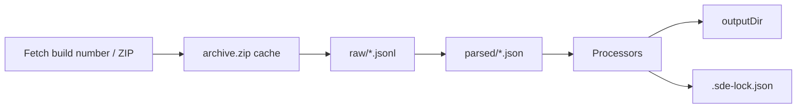
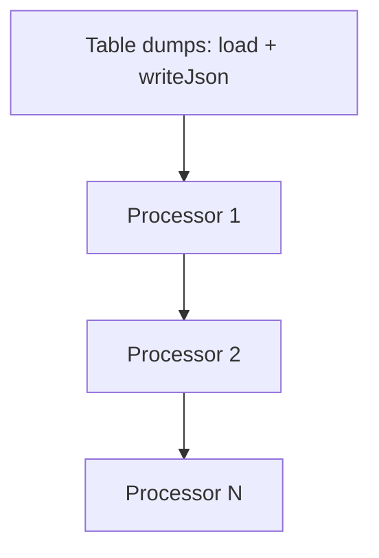

# eve-sde architecture

`@eve-online-tools/eve-sde` downloads CCP's Static Data Export (SDE), caches and parses JSONL tables, runs optional processors, and writes generated artifacts for downstream packages (`eve-ship-tree`, mantine-build rollups, etc.).

## Pipeline overview



1. **Resolve build number** — pinned `buildNumber` or latest from CCP.
2. **Download archive** — `archive.zip` under `.cache/eve-sde/<buildNumber>/`.
3. **Extract raw tables** — per-table `.jsonl` files in `raw/`.
4. **Parse** — keyed objects in `parsed/<table>.<format>.json` (format key reflects `jsonSpace`).
5. **Dump + processors** — table dumps and custom processors write to `outputDir`.
6. **Lock** — `.sde-lock.json` records the config fingerprint.

## Cache layout

```
.cache/eve-sde/
└── <buildNumber>/
    ├── archive.zip
    ├── raw/
    │   └── types.jsonl
    └── parsed/
        └── types.compact.json   # or types.s2.json when jsonSpace: 2
```

`outputDir` (separate from cache) holds generated artifacts and `.sde-lock.json`.

## Skip vs regenerate

Before processing, `shouldSkipProcessing` reads `.sde-lock.json` and compares it to the current config via `lockMatchesConfig`.

| Outcome | When |
| --- | --- |
| **Skip** | Lock exists and matches `buildNumber`, `tables`, `jsonSpace`, and processor `{ id, version }` pairs |
| **Regenerate** | No lock, `force: true`, or any fingerprint field changed |

Bump a processor's `version` when `run` logic changes. Use `force: true` for one-off local refreshes.

Lock fields (`lockSchemaVersion: 2`):

- `buildNumber`
- `tables` — `{ name, outputFile }[]`
- `jsonSpace` — `null` for compact JSON, or a number
- `processors` — `{ id, version }[]`
- `generatedAt` — informational only (not compared)

## Processor execution

Processors run **in config order** after configured table dumps.



Each processor receives `SdeProcessorContext`:

| API | Purpose |
| --- | --- |
| `load(table)` | Full parsed table (in-memory) — prefer `loadStream` for large tables |
| `loadStream(table)` | Stream SDE records line by line |
| `generated(id)` | Return value from an earlier processor |
| `generatedStream(id, file?)` | Read NDJSON written by an earlier processor |
| `writeJson` / `writeText` | Write files under `outputDir` |
| `streamJson` / `streamText` | Incremental writers |
| `resolve(...segments)` | Safe path join under `outputDir` |

`stripFields` is a built-in processor that versions itself from its options hash. Its processor id is `strip-fields:<tableName>` so it does not collide with custom pipeline step names.

## Plugin lifecycle

Both plugins call `processSdeWithResolvedOptions` in `buildStart`.

| | Vite | Rollup |
| --- | --- | --- |
| **Options resolved** | `configResolved` (uses `config.root`) | First `buildStart` (uses `options.root ?? cwd`) |
| **Hook** | `buildStart` | `buildStart` |
| **Enforce** | `pre` | default |

Rollup requires an explicit `root` option when `outputDir` or `cacheDir` are relative. Vite uses the Vite project root automatically.

## Import surfaces

| Entry | Use when |
| --- | --- |
| `@eve-online-tools/eve-sde` | Build scripts, `processSde`, built-in processors |
| `@eve-online-tools/eve-sde/vite` | Vite config |
| `@eve-online-tools/eve-sde/rollup` | Rollup config |
| `@eve-online-tools/eve-sde/processors` | Runtime JSONL parsing only (slim bundle) |

The main entry re-exports `parseJsonlTable` and friends, but `/processors` is the preferred runtime import when you only need parsing utilities.

## Development

From the monorepo root:

```bash
pnpm --filter @eve-online-tools/eve-sde test
pnpm --filter @eve-online-tools/eve-sde typecheck
pnpm --filter @eve-online-tools/eve-sde format:check
pnpm --filter @eve-online-tools/eve-sde oxlint
```
